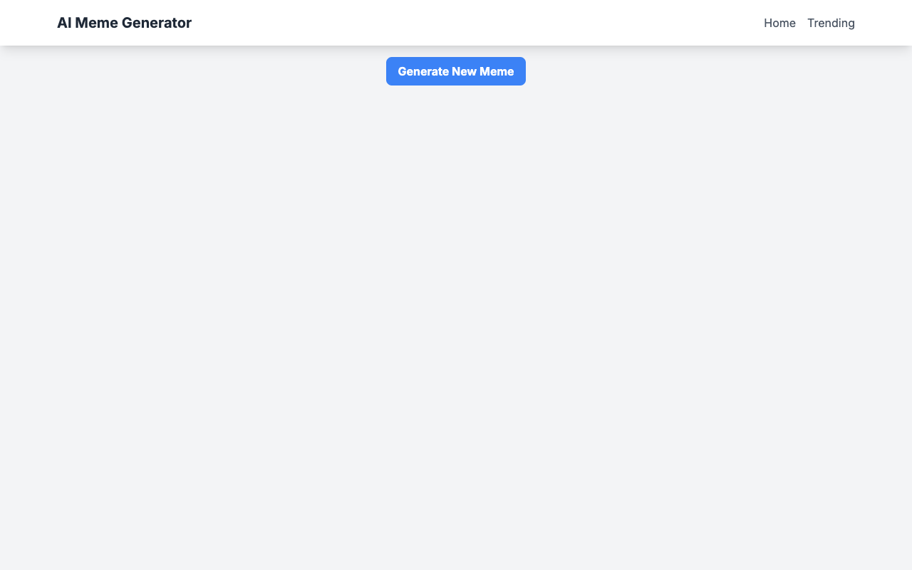
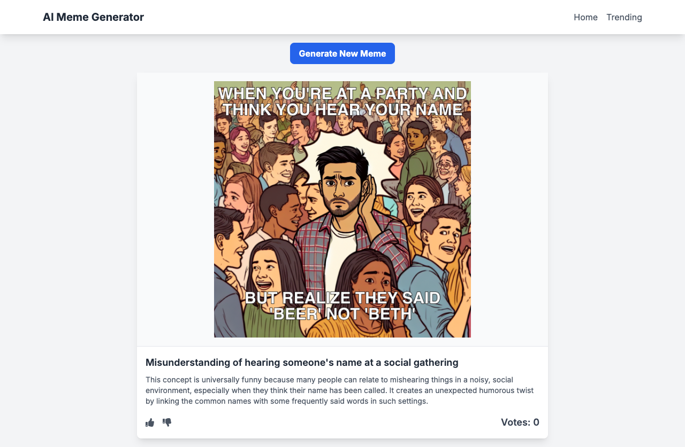
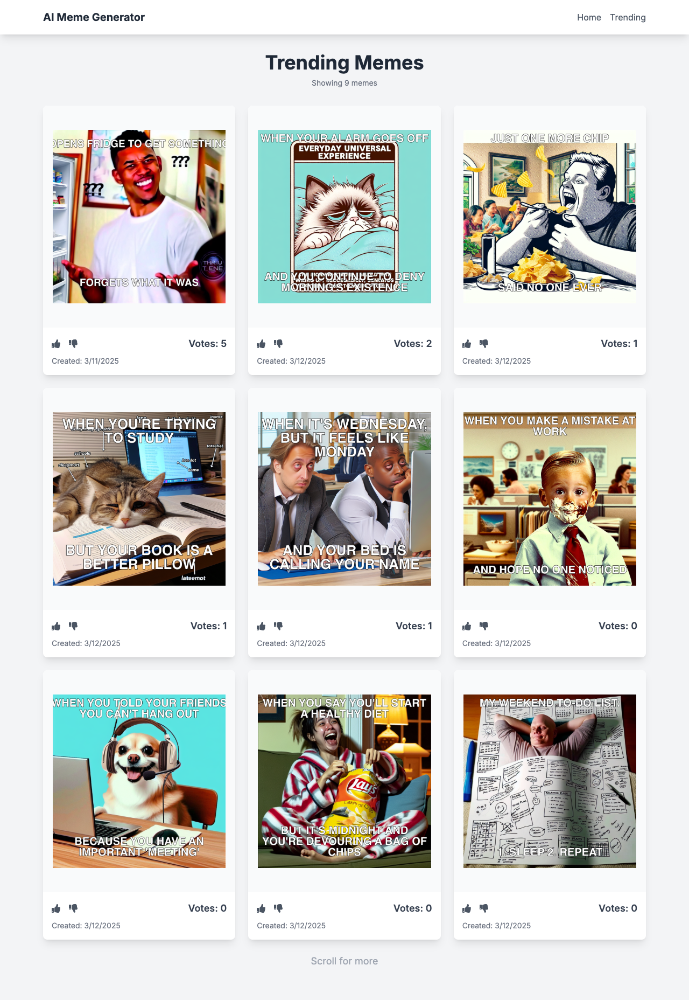

# Vibecode Meme Generator

A modern web application that generates and manages memes using AI. Built with Next.js, TypeScript, and Tailwind CSS.

## Project Creation

This project was developed through an AI pair programming session using Claude (via Cursor), demonstrating the potential of AI-assisted development. The entire application - from initial setup to debugging and optimization - was created through natural language conversations with the AI agent, which helped:

- Design and implement the full-stack architecture
- Write and debug React components and API routes
- Set up the database schema and migrations
- Implement AI-powered meme generation
- Debug layout and functionality issues
- Create automated tests
- Generate comprehensive documentation (including this README!)

The development process showcases how AI can serve as an effective pair programming partner while maintaining high code quality and following best practices.

You can explore the complete development journey in the `.specstory/history` directory, which contains all AI pair programming conversations and code changes made during the development process. This provides a transparent look at how each feature was conceived, implemented, and refined through AI collaboration.

## Development Timeline

The entire application was built in approximately 5.5 hours of active development time across two days:

### Day 1 (3h 15m)

1. Initial Setup (~45m)

   - Project creation
   - Dependencies installation
   - Basic file structure
   - Environment setup

2. Core Features (~1h 30m)

   - OpenAI integration
   - Meme generation API
   - Basic UI components
   - Database schema setup

3. Voting System (~1h)
   - API endpoints for voting
   - Vote UI components
   - Database integration

### Day 2 (2h 15m)

1. Trending Page (~1h)

   - Page layout
   - Infinite scroll implementation
   - Data fetching optimization

2. Bug Fixes & Improvements (~1h 15m)
   - Layout responsiveness
   - Data fetching issues
   - Performance optimization
   - Error handling

### Development Breakdown

- Frontend work: ~2.5 hours
- Backend work: ~2 hours
- DevOps/Setup: ~1 hour

Most time-intensive tasks were setting up AI meme generation (~1h), implementing infinite scroll (~45m), and debugging data fetching issues (~45m).

### Project Stats

- Total lines of code: 827 across 10 files
- AI Communication: 195 messages totaling 3,094 words
- Development sessions: 4 (spanning 2 days)

## Demo

### Home Page

Initial state:


After generating a meme:


### Trending Page



## Features

- AI-powered meme generation
- Real-time meme voting system
- Trending memes page with infinite scroll
- Responsive design for all screen sizes
- Clean and modern UI

## Tech Stack

- **Frontend**: Next.js 14, React, TypeScript
- **Styling**: Tailwind CSS
- **Database**: Prisma with SQLite
- **API**: Next.js API Routes
- **AI Integration**: OpenAI

## Getting Started

1. Clone the repository:

```bash
git clone [your-repo-url]
cd vibecode
```

2. Install dependencies:

```bash
npm install
```

3. Set up environment variables:

- Copy `.env.example` to `.env`
- Add your OpenAI API key and other required variables

4. Set up the database:

```bash
npx prisma migrate dev
```

5. Run the development server:

```bash
npm run dev
```

6. Open [http://localhost:3000](http://localhost:3000) in your browser

## Environment Variables

Create a `.env` file with the following variables:

```
OPENAI_API_KEY=your_api_key_here
```

## Project Structure

- `/src/app` - Next.js app router pages and components
- `/src/app/api` - API routes for meme generation and management
- `/prisma` - Database schema and migrations
- `/public` - Static assets

## Contributing

1. Fork the repository
2. Create your feature branch (`git checkout -b feature/amazing-feature`)
3. Commit your changes (`git commit -m 'Add some amazing feature'`)
4. Push to the branch (`git push origin feature/amazing-feature`)
5. Open a Pull Request

## License

This project is licensed under the MIT License - see the LICENSE file for details.
